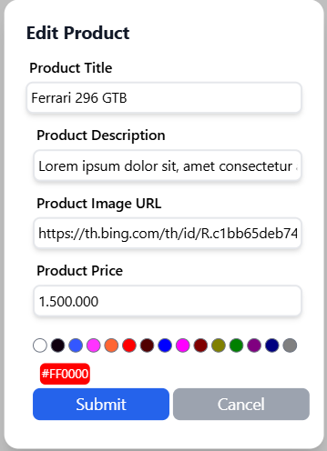
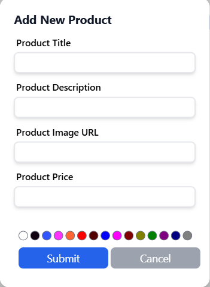
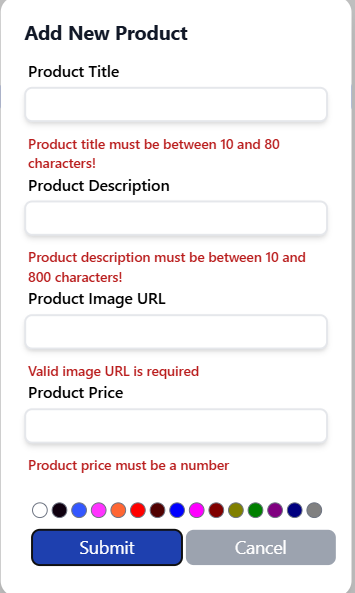
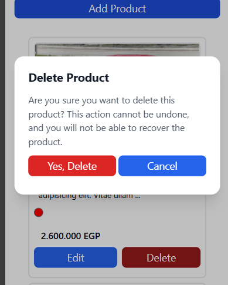

# Product Builder
## React + TypeScript + Vite

<h3>🛠️ The project is a web application with the following features: </h3>

<ul>
  <li> Edit Products: You can modify any existing product. 🛠️</li>
    
  <li> Add New Products: You can add new products to the list. ➕</li>
     Add form 
    
     
     Vaidation 
    
  <li>Delete Products: You can remove any product from the list. ❌ </li>
    
</ul>
